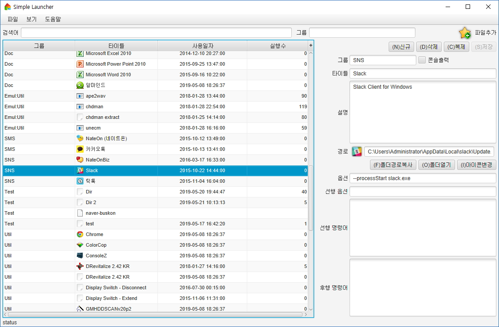

# Simple Launcher

## Introduction

***Simple Launcher*** is designed to launch all of your application simply and to search easily.

It accepts executable command or relative path to run so you could customize your own application launcher independent with OS.

## Requirements

- Java 11 above
- JavaFX 12 above

## CommandLine Arguments

| argument       | description                                         |
| -------------- | --------------------------------------------------- |
| help (or h)    | show help                                           |
| clear          | clear memorized application configuration           |
|                | (for example, last window position)                 |

### example

    java -jar SimpleLauncher.jar clear

## Shortcuts

### Menu

| shortcut             | description                   |
| --------------       | ------------------            |
| Ctrl + Shift + **I** | import application catalog    |
| Ctrl + Shift + **X** | export application catalog    |
| Ctrl + Shift + **D** | clear  application catalog    |
| ALT + **E**          | toggle detail launcher editor |
| ALT + **V**          | toggle menu bar               |
| Ctrl + Shift + **F** | set windows on top always     |
| **F1**               | show help                     |

### Main catalog

| shortcut       | description        |
| -------------- | ------------------ |
| Enter          | execute item       |
| Delete         | delete item        |

### Launcher editor

only works when Launcher editor is opened.

| shortcut       | description             |
| -------------- | ------------------      |
| Ctrl + **N**   | new item                |
| Ctrl + **D**   | delete item             |
| Ctrl + **C**   | copy item               |
| Ctrl + **S**   | save item               |
| Ctrl + **F**   | copy item's folder path |
| Ctrl + **O**   | open item's folder      |
| Ctrl + **I**   | change item icon        |

## Binding parameters

Item's ***option***(or prefix option) could have parameter and it would replace to file(or directory) path
being injected when runs by file(or directory) dragging.

| parameter      | description         | example               |
| -------------- | ------------------  | --------------------- |
| \#{filepath}   | file's full path    | /usr/path/readme.md   |
| \#{path}       | path                | /user/path            |
| \#{filename}   | file name           | readme.md             |
| \#{name}       | base name           | readme                |
| \#{ext}        | extension           | md                    |
| \#{home}       | user home directory | /home/***user***      |

### Example

   ape2wav.exe "#{filepath}" "#{path}\#{name}.wav"  

## Contact

FAQs  : https://github.com/nayasis/SimpleLauncher2/issues

email : [nayasis@gmail.com](mailto:nayasis@gmail.com)
